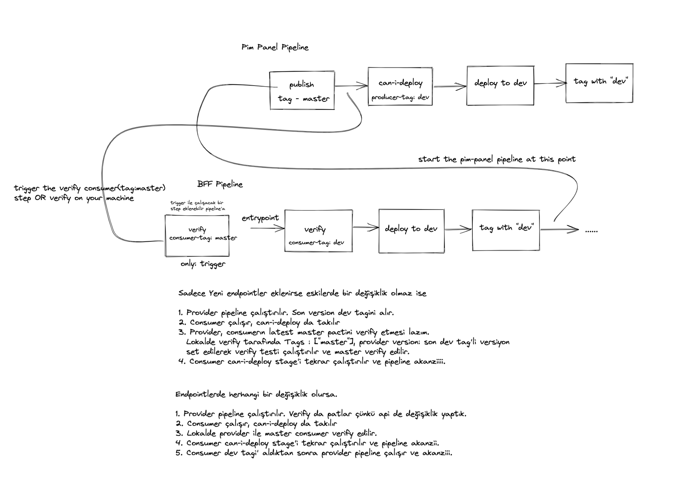

# Akış

https://excalidraw.com/#room=a8342d52e74edc0a3edb,gAepYGaZakDjJgInFRuz6g

# Notlar

- Pact dosya içeriği değişmeden gelen yeni versiyonların yeniden verify edilmesine gerek yok.
- Can-i-deploy "--pacticipant MyConsumer --version 3 --to dev" MyConsumer adlı pacticipantın versiyon numarası 3 olan pact dosyasının karşısındaki dev tagli pacticipantın verify edip etmediğini sorgulayan bir komut.
- Verify provider da tags kısmı pactURL verilmediği zaman çalışır. Belirli taglere sahip bütün consumerları verify etmeye çalışır.

## Pact URLS

* `http://localhost/pacts/provider/MyProvider/consumer/MyConsumer/latest` EN son yayınlanan pact dosyası, MyProvider ile MyConsumer arasındaki

* `http://localhost/pacts/provider/MyProvider/consumer/MyConsumer/latest/{tag}` Verilen taga sahip en son pact dosyası